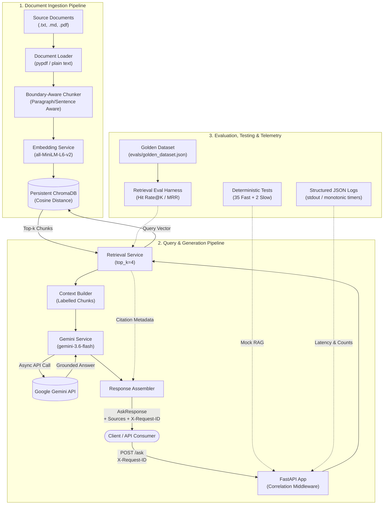

# production-rag-assistant

[](https://www.python.org/downloads/release/python-3110/)
[](https://fastapi.tiangolo.com/)
[](https://github.com/arzucaner/production-rag-assistant/actions/workflows/ci.yml)

A production-oriented Retrieval-Augmented Generation (RAG) backend built with Python 3.11, FastAPI, local Sentence Transformers, persistent ChromaDB, and Google Gemini.

This repository demonstrates applied AI engineering fundamentals across the full RAG lifecycle: document loading and boundary-aware semantic chunking, local vector indexing, semantic retrieval, grounded generation with deterministic citations, golden-set retrieval evaluation, cost-conscious LLM testing, containerisation with Docker, GitHub Actions CI, and privacy-conscious structured observability.

It is designed as an educational, portfolio-grade project emphasizing empirical evaluation and engineering trade-offs rather than framework magic.

---

## Highlights

- **End-to-end RAG pipeline:** Modular, testable architecture separating document ingestion, vector retrieval, and LLM generation.
- **Boundary-aware semantic chunking:** Splits documents cleanly along paragraphs, sentences, and words to preserve semantic evidence.
- **Cost-free local embeddings:** Sentence Transformers (`all-MiniLM-L6-v2`) embed documents and queries locally without external API dependencies or costs.
- **Deterministic source citations:** Citation metadata (source name, page number, chunk ID) is mapped directly from retrieval results, never hallucinated by the LLM.
- **Empirical retrieval evaluation:** Offline golden-set evaluation harness measuring Hit Rate@K and Mean Reciprocal Rank (MRR) without calling external LLM APIs.
- **Zero-secret CI:** GitHub Actions runs 35 fast deterministic tests and validates Docker builds without needing external credentials or LLM quotas.
- **Lightweight observability:** Structured JSON logging to `stdout`, `X-Request-ID` request correlation via `ContextVar`, monotonic stage timing (`time.perf_counter()`), and strict exclusion of sensitive payloads.
- **Cost-bounded live LLM evaluation:** Optional CLI harness for generation quality with rate-limiting guardrails, HTTP timeouts, and disabled SDK retries.

---

## Measured Evaluation Results

Retrieval quality is measured empirically using `evals/golden_dataset.json` against the knowledge base with `top_k=4`:

| Metric | Baseline (Fixed-Char Chunking) | Candidate (Boundary-Aware Chunking) | Delta |
|---|:---:|:---:|:---:|
| **Hit Rate @ 4** | 85.7% (6/7) | **100.0% (7/7)** | **+14.3%** |
| **MRR** | 0.857 | **1.000** | **+0.143** |
| **Failed Answerable Cases** | 1 (`ans-006`) | **0** | **-1** |
| **`ans-006` Rank** | Rank 5 (Miss) | **Rank 1 (Hit)** | **+4 ranks** |

> **Evaluation Disclaimer:** This is a small, controlled portfolio benchmark (7 answerable cases, 4 unanswerable cases on a controlled sample corpus). It proves that the retrieval improvement was achieved through an empirical chunking experiment—fixing boundary fragmentation without changing `top_k`, the embedding model, or the evaluation dataset. It is not a claim of general production accuracy across arbitrary corpora.
>
> Full experiment log: [`backend/evals/experiments/chunking_experiment.md`](backend/evals/experiments/chunking_experiment.md).

---

## Architecture



---

## Engineering Decisions

1. **Local embeddings over external APIs:** Sentence Transformers (`all-MiniLM-L6-v2`) generate 384-dimensional dense vectors locally. This eliminates embedding API costs, removes third-party rate limits during indexing, and guarantees that documents and queries exist in the exact same vector space.
2. **Deterministic citations from retrieval metadata:** LLMs frequently hallucinate sources when asked to cite document names in natural language. Citations in this project are constructed directly from retrieved chunk metadata (source file, page number, chunk ID) and attached by the application layer.
3. **Deterministic tests decoupled from LLMs:** Automated test suites in `tests/` never call Gemini. API integration tests override `get_rag_service` with a `FakeRagService`. This prevents test flakiness, latency, network dependency, and API quota burn.
4. **Zero-secret Continuous Integration:** GitHub Actions executes all 35 fast tests and validates the Docker build without requiring `GEMINI_API_KEY`. CI remains deterministic, requires no LLM API secrets, and incurs no LLM API cost.
5. **Baseline before optimization:** Rather than guessing retrieval improvements, a baseline was established on a 11-case golden dataset. When `ans-006` failed, the failure was inspected before changing code.
6. **Single-variable experimentation:** To fix `ans-006`, only the chunk boundary strategy was altered. Target chunk size (500), overlap (100), embedding model, vector space, and `top_k=4` were held constant to ensure valid causal attribution.
7. **Stateless container, stateful volume:** The vector database (`data/vector_store`) is never baked into the Docker image. It persists across container lifecycles via a named Docker volume (`rag_vector_store`), keeping image artifacts immutable and portable.
8. **Privacy-conscious structured logging:** Logs are formatted as single-line JSON to `stdout` for container log routers. Metadata such as request IDs, stage latencies, chunk counts, and model names are logged; user question text, document contents, answers, embeddings, and API keys are strictly excluded.
9. **Async context-local request tracing:** `contextvars.ContextVar` propagates `X-Request-ID` from FastAPI middleware through coroutines and worker threads (`asyncio.to_thread`) without passing correlation arguments through every function signature. Tokens are reset in a `finally` block to prevent leakage across pooled tasks.

---

## Free Local Operations vs Live LLM Operations

To protect external API quotas and avoid unnecessary billing, operations are divided by design:

| Operation | Command | External LLM / Gemini Quota |
|---|---|:---:|
| **Unit & Integration Tests** | `pytest -m "not slow"` | **Zero (Free / Offline)** |
| **Document Ingestion & Indexing** | `python -m app.ingestion.indexer` | **Zero (Free / Local Embeddings)** |
| **Retrieval Evaluation** | `python -m evals.evaluate_retrieval` | **Zero (Free / Offline)** |
| **Container Build & CI Checks** | `docker build`, GitHub Actions | **Zero (Free / No Secrets)** |
| **API Liveness Check** | `GET /health` | **Zero (Free / Local)** |
| **Live Grounded Question Answering** | `POST /ask` | **Consumes Gemini API Quota** |
| **Bounded Live Generation Eval** | `python -m evals.evaluate_generation` | **Consumes Gemini API Quota** |

---

## Quick Start

### Option A: Local Python (Windows / macOS / Linux)

Prerequisites: **Python 3.11** (recommended for prebuilt Chroma binary wheels) and Git.

```bash
# 1. Clone repository and navigate to backend
git clone https://github.com/arzucaner/production-rag-assistant.git
cd production-rag-assistant/backend

# 2. Create and activate a virtual environment
python -m venv .venv
# Windows PowerShell:  .venv\Scripts\Activate.ps1
# Linux/macOS:         source .venv/bin/activate

# 3. Install dependencies
pip install --upgrade pip
pip install -r requirements.txt
pip install -r requirements-dev.txt

# 4. Configure environment
copy .env.example .env    # Linux/macOS: cp .env.example .env
# Edit .env and set GEMINI_API_KEY=your_key_here (only needed for POST /ask)

# 5. Index sample documents into local ChromaDB
python -m app.ingestion.indexer --path data/documents --clean

# 6. Start the API server
uvicorn app.main:app --reload --port 8000
```

Verify endpoints:
```bash
# Health check (zero LLM calls)
curl http://127.0.0.1:8000/health

# Grounded Q&A (requires valid GEMINI_API_KEY)
curl -X POST http://127.0.0.1:8000/ask \
  -H "Content-Type: application/json" \
  -d "{\"question\": \"What is retrieval-augmented generation?\"}"
```
Interactive OpenAPI documentation is available at `http://127.0.0.1:8000/docs`.

---

### Option B: Docker Container

The containerized backend packages Python 3.11-slim, application code, and dependencies into a reproducible image. Chroma data persists in a named volume.

```bash
# 1. Navigate to backend
cd production-rag-assistant/backend

# 2. Build the Docker image
docker build -t production-rag-assistant:local .

# 3. Index sample documents into a persistent Docker volume
docker run --rm \
  -v rag_vector_store:/app/data/vector_store \
  production-rag-assistant:local \
  python -m app.ingestion.indexer --path data/documents --clean

# 4. Run the API container with runtime secrets
docker run --rm -p 8000:8000 \
  --env-file .env \
  -v rag_vector_store:/app/data/vector_store \
  production-rag-assistant:local

# 5. Test health from host
curl http://127.0.0.1:8000/health
```

---

## Testing and Evaluation

### Automated Tests (pytest)

From `backend/`:

```bash
# Fast deterministic test suite (35 tests, mock-backed, runs in ~1.5s, used by CI)
python -m pytest -m "not slow"

# Full test suite (37 tests, includes slow temporary embedding & Chroma tests)
python -m pytest
```

### Retrieval Evaluation (Hit Rate@K & MRR)

Requires sample documents to be indexed first (`python -m app.ingestion.indexer --path data/documents --clean`):

```bash
python -m evals.evaluate_retrieval
```
Computes Hit Rate@4 and MRR against `evals/golden_dataset.json` using exact/normalized evidence substring matching.

### Optional Live Generation Evaluation

Requires `GEMINI_API_KEY`. Live evaluation is intentionally an **opt-in manual CLI** with strict guardrails (disabled SDK retries, 60s timeout, delay between requests) to protect free-tier quotas:

```bash
# Safest bounded evaluation: exactly 1 test case with a 15s delay
python -m evals.evaluate_generation --max-cases 1 --delay-seconds 15 --stop-on-provider-error

# Small batch (default 3 cases)
python -m evals.evaluate_generation --max-cases 3 --delay-seconds 15
```

---

## Continuous Integration

GitHub Actions workflow: [`.github/workflows/ci.yml`](.github/workflows/ci.yml)

On every push and pull request to `main`, CI executes:
1. **Python 3.11 setup & dependency caching**
2. **Deterministic test suite:** `python -m pytest -m "not slow"` (35 tests)
3. **Application import validation:** verifies module dependencies and routes
4. **Docker image build:** validates container buildability via Buildx

CI does **not** require secrets, does **not** call Gemini, and does **not** perform cloud deployment. It validates code correctness and container reproducibility.

---

## Observability

Lightweight, standard-library structured observability without external agents or vendor dependencies.

### Capabilities
- **Structured JSON logging:** Formatted records stream to `stdout` with ISO-8601 UTC timestamps, log level, logger name, and event identifiers.
- **Request correlation (`X-Request-ID`):** Incoming client request IDs are sanitized (`^[a-zA-Z0-9_\-\.]{1,128}$`) or auto-generated as UUID4, returned in HTTP response headers, and injected into all log entries during the request.
- **Monotonic timing:** Measures stage latencies using `time.perf_counter()`, preventing timing distortions caused by NTP adjustments or system clock shifts.
- **De-noised health checks:** Routine successful `/health` requests are logged at `DEBUG` level to prevent container log flooding, while degraded health responses are logged at `WARNING`/`ERROR`.
- **Privacy-first policy:** Sensitive data is never logged. User questions, retrieved chunk text, generated answers, embeddings, and API keys are strictly excluded. Only safe metadata (lengths, counts, model names, durations, status codes) is emitted.

### Example Structured Log Events (Synthetic Data)

```json
{"timestamp": "2026-09-12T09:30:15.123456Z", "level": "INFO", "logger": "app.rag", "event": "retrieval_completed", "request_id": "c9bf9e57-1685-4c89-bafb-ff5af830be8a", "top_k": 4, "chunks_returned": 4, "source_count": 1, "duration_ms": 18.72}
{"timestamp": "2026-09-12T09:30:16.456789Z", "level": "INFO", "logger": "app.rag", "event": "generation_completed", "request_id": "c9bf9e57-1685-4c89-bafb-ff5af830be8a", "model": "gemini-3.6-flash", "citation_count": 2, "duration_ms": 612.41}
{"timestamp": "2026-09-12T09:30:16.460123Z", "level": "INFO", "logger": "app.http", "event": "http_request_completed", "request_id": "c9bf9e57-1685-4c89-bafb-ff5af830be8a", "method": "POST", "path": "/ask", "status_code": 200, "duration_ms": 635.85}
```

---

## Project Structure

```text
production-rag-assistant/
├── backend/
│   ├── app/
│   │   ├── core/           # Settings, exceptions, structured JSON logging & ContextVar
│   │   ├── ingestion/      # Document loaders, boundary-aware chunking, indexing CLI
│   │   ├── prompts/        # Grounded system instructions and context prompt builder
│   │   ├── routers/        # FastAPI endpoints (/health, /ask)
│   │   ├── schemas/        # Pydantic request/response validation schemas
│   │   ├── services/       # Embeddings, vector store, retrieval, Gemini, RAG orchestration
│   │   └── main.py         # Application entrypoint & request correlation middleware
│   ├── data/
│   │   ├── documents/      # Source knowledge documents (sample-rag-overview.md)
│   │   └── vector_store/   # Persistent ChromaDB storage (local, gitignored)
│   ├── evals/
│   │   ├── experiments/    # Empirical experiment notes (chunking_experiment.md)
│   │   ├── golden_dataset.json  # 11-case evaluation dataset (7 answerable, 4 unanswerable)
│   │   ├── evaluate_retrieval.py   # Offline Hit Rate@K & MRR harness
│   │   └── evaluate_generation.py  # Optional bounded live generation evaluation
│   ├── tests/              # 37 automated tests (unit, integration, deterministic mocks)
│   ├── Dockerfile          # Reproducible container image (Python 3.11-slim)
│   ├── requirements.txt    # Production runtime dependencies
│   └── requirements-dev.txt# Testing dependencies (pytest, httpx)
├── docs/                   # Developer guides (local setup, dependency rationale)
├── notes/                  # Chronological engineering progression notes
├── .github/workflows/      # GitHub Actions CI workflow (ci.yml)
└── README.md
```

---

## Scope & Limitations

This project is an applied AI engineering milestone with deliberate scope boundaries:
- **Small evaluation corpus:** The current golden dataset evaluates 11 cases on one sample document. It demonstrates evaluation methodology, not universal accuracy.
- **Single-node embedded vector database:** Chroma runs embedded with SQLite/HNSW. It is suited for single-instance or volume-mounted setups, not distributed vector clusters.
- **No authentication / authorization:** The API does not implement API key verification or OAuth; it is intended to sit behind an API gateway in real production deployments.
- **No reranking or hybrid search:** Retrieval relies on bi-encoder cosine similarity. Hybrid BM25 retrieval and cross-encoder reranking are natural next steps.
- **No distributed tracing backend:** Request correlation uses `X-Request-ID` and JSON logs. OpenTelemetry spans and collector export are deferred.
- **Docker image size:** The image is approximately 9–10 GB uncompressed on Linux because standard PyPI installation of PyTorch (pulled in by `sentence-transformers`) bundles default NVIDIA CUDA runtime wheels (such as `cuda-toolkit`, `nvidia-cudnn`, and `triton`), even though the application runs purely in CPU-only mode.
- **Cold start latency:** The first embedding request after startup incurs a 2-3 second model initialization delay on CPU.
- **External LLM dependency:** Grounded answer generation relies on Google Gemini availability and rate limits.

---

## Future Work

- **Multi-document evaluation corpus:** Expand golden datasets across complex document layouts, tables, and varied domains.
- **Hybrid retrieval & reranking:** Benchmark BM25 + dense retrieval with a cross-encoder reranker (e.g., `bge-reranker-base`).
- **CPU optimization:** Point pip to CPU-specific PyTorch wheels (`--index-url https://download.pytorch.org/whl/cpu`) or export embeddings to ONNX Runtime / int8 quantization to drastically reduce Docker image size and inference latency.
- **OpenTelemetry integration:** Export OTLP trace spans from the existing stage timers to Jaeger or Grafana Tempo.
- **Cloud vector store migration:** Support external managed vector databases (e.g., Pinecone, Qdrant, pgvector).

*Note: Multi-agent orchestration, LangGraph, and Model Context Protocol (MCP) will be explored in dedicated separate repositories to maintain this codebase as a focused, modular RAG reference.*

---

## Repository Status

**Portfolio Milestone Complete.**

The core production-oriented RAG lifecycle—ingestion, boundary-aware chunking, vector indexing, retrieval, grounded generation, automated testing, empirical evaluation, containerisation, CI, and observability—is verified and complete. Future updates will focus on maintenance, dependency updates, and evidence-driven experiments.

---

## Documentation Links

- [Local Development Guide](docs/local-development.md)
- [Backend Dependency Rationale](docs/backend-dependencies.md)
- [Retrieval Experiment: Boundary-Aware Chunking](backend/evals/experiments/chunking_experiment.md)
- [Docker Configuration](backend/Dockerfile)
- [CI Workflow](.github/workflows/ci.yml)
